```mermaid
classDiagram
  class AccountsView {
    +openBulkEditScopeSelector()
    +confirmBulkEditScopeSelection()
    +BulkEditAccountScopedModal
  }
  class BulkEditAccountScopedModal {
    +resolveBulkEditScopeEditorKey()
    +scopeComponentMap
  }
  class BulkEditOpenAIOAuthModal
  class BulkEditOpenAIApiKeyModal
  class BulkEditAnthropicOAuthModal
  class BulkEditAnthropicSetupTokenModal
  class BulkEditAnthropicApiKeyModal
  class BulkEditGeminiOAuthModal
  class BulkEditGeminiApiKeyModal
  class BulkEditAntigravityOAuthModal
  class BulkEditAntigravityUpstreamModal
  class BulkEditSoraOAuthModal
  class BulkEditSoraApiKeyModal
  class BulkEditAccountModal

  AccountsView --> BulkEditAccountScopedModal
  BulkEditAccountScopedModal --> BulkEditOpenAIOAuthModal
  BulkEditAccountScopedModal --> BulkEditOpenAIApiKeyModal
  BulkEditAccountScopedModal --> BulkEditAnthropicOAuthModal
  BulkEditAccountScopedModal --> BulkEditAnthropicSetupTokenModal
  BulkEditAccountScopedModal --> BulkEditAnthropicApiKeyModal
  BulkEditAccountScopedModal --> BulkEditGeminiOAuthModal
  BulkEditAccountScopedModal --> BulkEditGeminiApiKeyModal
  BulkEditAccountScopedModal --> BulkEditAntigravityOAuthModal
  BulkEditAccountScopedModal --> BulkEditAntigravityUpstreamModal
  BulkEditAccountScopedModal --> BulkEditSoraOAuthModal
  BulkEditAccountScopedModal --> BulkEditSoraApiKeyModal
  BulkEditOpenAIOAuthModal --> BulkEditAccountModal
  BulkEditOpenAIApiKeyModal --> BulkEditAccountModal
  BulkEditAnthropicOAuthModal --> BulkEditAccountModal
  BulkEditAnthropicSetupTokenModal --> BulkEditAccountModal
  BulkEditAnthropicApiKeyModal --> BulkEditAccountModal
  BulkEditGeminiOAuthModal --> BulkEditAccountModal
  BulkEditGeminiApiKeyModal --> BulkEditAccountModal
  BulkEditAntigravityOAuthModal --> BulkEditAccountModal
  BulkEditAntigravityUpstreamModal --> BulkEditAccountModal
  BulkEditSoraOAuthModal --> BulkEditAccountModal
  BulkEditSoraApiKeyModal --> BulkEditAccountModal
```

# 账号批量编辑设计图（先选平台+类型）

## 1) 顶部工具栏入口（红框位置）

```text
+---------------------------------------------------------------------------------------------+
| [刷新] [自动刷新] [错误透传规则] [列设置] [从CRS同步] [导入] [导出] [添加账号] [批量编辑(12)] |
+---------------------------------------------------------------------------------------------+
```

规则：
- 入口固定在工具栏，和你要求的红框位置一致。
- 未选中账号时点击：提示“请选择要编辑的账号”。
- 已选中时显示数量，如 `批量编辑(12)`。

## 2) 第一步：范围选择弹窗（必须手动选择）

```text
+----------------------------------------------------------------------------------+
| 批量编辑范围                                                                    X |
| 已选择 12 个账号，请先选择平台和账号类型。                                        |
|                                                                                  |
| 平台           [ 请选择平台 ▼ ]                                                   |
| 账号类型       [ 请选择账号类型 ▼ ]                                               |
|                                                                                  |
| 符合条件账号：6 个                                                                |
|                                             [取消] [打开批量编辑器]               |
+----------------------------------------------------------------------------------+
```

规则：
- 必须先选 `平台`，再选 `账号类型`。
- 类型列表根据当前平台动态变化（如 OAuth / API Key / setup-token / upstream 等）。
- 只有命中账号数 `> 0` 时，`打开批量编辑器` 才可点击。

## 3) 第二步：按平台+类型进入对应批量编辑页

```text
用户选择 scope = { platform, type }
      ↓
仅保留匹配账号 IDs
      ↓
打开对应批量编辑页面 / 弹窗
```

路由映射建议：
- `openai + oauth` -> `OpenAI OAuth 批量编辑`
- `openai + apikey` -> `OpenAI API Key 批量编辑`
- `anthropic + oauth/setup-token/apikey` -> `Anthropic 对应批量编辑`
- `gemini + oauth/apikey` -> `Gemini 对应批量编辑`
- `antigravity + oauth/upstream` -> `Antigravity 对应批量编辑`
- `sora + apikey` -> `Sora 批量编辑`

## 4) 交互与结果

- 提交成功后，仅从已选列表中移除本次已编辑的 scope 账号，便于继续编辑其它平台/类型。
- 保持失败提示和局部失败明细（success / failed）。

## 5) Mermaid 设计图（流程 + 组件映射）

```mermaid
flowchart TD
  A[账号列表页 AccountsView] --> B[红框按钮: 批量编辑]
  B --> C{是否已勾选账号}
  C -- 否 --> D[Toast: 请选择要编辑的账号]
  C -- 是 --> E[Scope 选择弹窗]
  E --> F[选择平台]
  F --> G[选择账号类型]
  G --> H[计算命中账号数]
  H --> I{命中 > 0 ?}
  I -- 否 --> J[禁用 打开批量编辑器]
  I -- 是 --> K[打开 Scoped 批量编辑器]
  K --> L[BulkEditAccountScopedModal]
  L --> M{platform:type 路由}
  M --> N1[openai:oauth]
  M --> N2[openai:apikey]
  M --> N3[anthropic:oauth/setup-token/apikey]
  M --> N4[gemini:oauth/apikey]
  M --> N5[antigravity:oauth/upstream]
  M --> N6[sora:oauth/apikey]
  N1 --> O[对应独立编辑页组件]
  N2 --> O
  N3 --> O
  N4 --> O
  N5 --> O
  N6 --> O
  O --> P[bulkUpdate(account_ids, updates)]
  P --> Q[成功/部分成功/失败提示 + 刷新列表]
```


